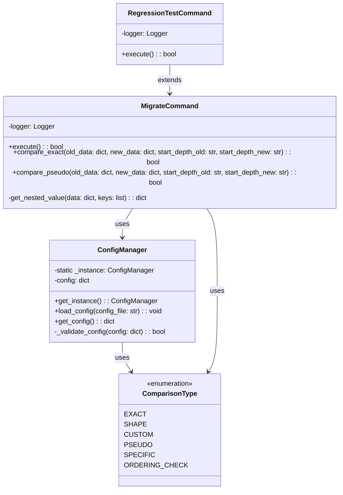
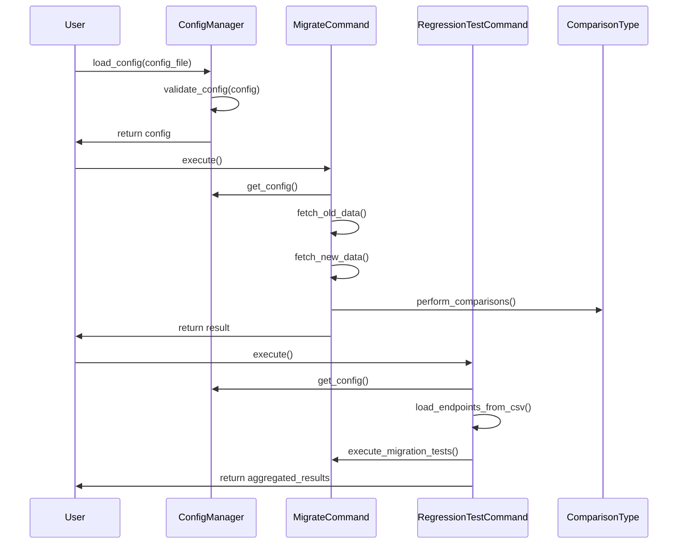

## Migrato: Architecture and Contribution Strategy

---

### Table of Contents
1. [Introduction](#introduction)
2. [Architecture Overview](#architecture-overview)
3. [Components](#components)
    - [ConfigManager](#configmanager)
    - [ComparisonType](#comparisontype)
    - [MigrateCommand](#migratecommand)
    - [RegressionTestCommand](#regressiontestcommand)
4. [UML Diagrams](#uml-diagrams)
5. [Contribution Strategy](#contribution-strategy)
6. [Conclusion](#conclusion)

---

### Introduction

Migrato is a tool designed to facilitate API endpoint migrations by comparing responses from old and new endpoints. It validates that the new endpoint's responses match the expected structure and content, ensuring a smooth transition during API migrations.

---

### Architecture Overview

Migrato follows a modular architecture with a clear separation of concerns. The main components include configuration management, comparison logic, and command execution. This design ensures scalability, maintainability, and ease of contribution.

---

### Components

#### ConfigManager

The `ConfigManager` is a singleton class responsible for loading, validating, and managing the configuration required for comparisons. It ensures that the configuration is correctly structured and converts comparison types to enums for robust type checking.

**Key Responsibilities:**
- Load and validate configuration files.
- Convert comparison types to `ComparisonType` enums.
- Provide configuration data to other components.

#### ComparisonType

The `ComparisonType` enum defines the different types of comparisons that can be performed between API responses. This enum ensures type safety and clarity in the comparison logic.

**Comparison Types:**
- EXACT
- SHAPE
- CUSTOM
- PSEUDO
- SPECIFIC
- ORDERING_CHECK

#### MigrateCommand

The `MigrateCommand` class is responsible for executing the migration test. It fetches responses from the old and new endpoints and performs comparisons based on the specified configuration.

**Key Responsibilities:**
- Fetch responses from old and new endpoints.
- Perform comparisons using the configured comparison types.
- Log the comparison process and results.

#### RegressionTestCommand

The `RegressionTestCommand` class extends the functionality of `MigrateCommand` to handle regression tests across multiple endpoints specified in a CSV file.

**Key Responsibilities:**
- Load and parse the CSV file containing old and new endpoint pairs.
- Execute migration tests for each pair.
- Aggregate and report the results of all tests.

---

### UML Diagrams

#### Class Diagram


#### Sequence Diagram


---

### Contribution Strategy

#### Overview

Migrato welcomes contributions from the community. Our goal is to foster a collaborative environment where developers can enhance the tool's functionality, improve its performance, and add new comparison strategies.

#### How to Contribute
Types of Contributions
Reporting Bugs: If you find a bug, let us know by creating an issue.
Feature Requests: If you have an idea for a new feature, suggest it by opening an issue.
Code Contributions: Help us improve the codebase by fixing bugs, adding new features, or improving documentation.
Reviewing Code: Provide feedback on pull requests to help maintain the quality of the codebase.

#### Code Style
PEP 8: Follow the PEP 8 style guide for Python code.
Docstrings: Write clear and concise docstrings for all functions and classes.
Comments: Use comments to explain complex logic or code sections.

#### Testing
Unit Tests: Write unit tests for all new features and bug fixes.
Coverage: Ensure tests have high coverage of the codebase.
CI: All tests must pass before a pull request can be merged.

#### Communication Channels
GitHub Issues: Use GitHub issues for tracking bugs, feature requests, and other discussions.
Pull Requests: Use pull requests for code reviews and discussions.
Email: You can contact the maintainers via email for any private or sensitive matters.

#### Example contribution flow - New Strategy: Pseudo Match

**Description:**
The `Pseudo Match` strategy provides a detailed comparison report highlighting which keys matched and which did not, offering insights into potential discrepancies.

**Implementation Steps:**
1. **Define Enum:**
   Add `PSEUDO` to the `ComparisonType` enum.

   ```python
   class ComparisonType(Enum):
       EXACT = "exact"
       SHAPE = "shape"
       CUSTOM = "custom"
       PSEUDO = "pseudo"
       SPECIFIC = "specific"
       ORDERING_CHECK = "orderingCheck"
   ```

2. **Update ConfigManager:**
   Ensure `ConfigManager` recognizes and validates the new comparison type.

   ```python
   def _validate_config(self, config):
       ...
       try:
           ComparisonType[comparison["comparison_type"].upper()]
       except KeyError:
           return False
   ```

3. **Implement Pseudo Match Logic:**
   Extend `MigrateCommand` to handle the `PSEUDO` comparison type.

   ```python
   def execute(self):
       ...
       for comparison in comparisons:
           if comparison['comparison_type'] == ComparisonType.PSEUDO:
               if not self.compare_pseudo(old_data, new_data, comparison['start_depth_old'], comparison['start_depth_new']):
                   self.logger.error("Pseudo comparison failed")
                   return False
       ...

   def compare_pseudo(self, old_data, new_data, start_depth_old, start_depth_new):
       old_value = self.get_nested_value(old_data, start_depth_old.split('.'))
       new_value = self.get_nested_value(new_data, start_depth_new.split('.'))
       
       matched_keys = old_value.keys() & new_value.keys()
       unmatched_keys = old_value.keys() ^ new_value.keys()

       self.logger.debug("Matched keys: %s", matched_keys)
       self.logger.debug("Unmatched keys: %s", unmatched_keys)

       return len(unmatched_keys) == 0
   ```

4. **Update Tests:**
   Add unit tests for the new `PSEUDO` comparison type.

   ```python
   def test_compare_pseudo():
       old_data = {"data": {"key1": "value1", "key2": "value2"}}
       new_data = {"data": {"key1": "value1", "key2": "value2", "key3": "value3"}}

       config_manager = ConfigManager.get_instance()
       config_manager.load_config('test_data/mock_config.json')
       
       command = MigrateCommand()
       assert command.compare_pseudo(old_data, new_data, 'data', 'data') == False
   ```

#### Contribution Guidelines

1. **Fork the Repository:**
   Create a fork of the repository on GitHub.

2. **Create a Branch:**
   Create a new branch for your feature or bugfix.

   ```sh
   git checkout -b feature/pseudo-match
   ```

3. **Write Tests:**
   Ensure your contribution is covered by unit tests.

4. **Submit a Pull Request:**
   Submit a pull request with a detailed description of your changes and link to the related issue.

5. **Review Process:**
   Participate in the review process and address any feedback from maintainers.

---

### Conclusion

Migrato is a robust tool designed to simplify API endpoint migrations. Its modular architecture and clear separation of concerns make it easy to extend and maintain. By following the contribution strategy, developers can add new comparison strategies and enhance the tool's functionality, ensuring it continues to meet the needs of its users.
